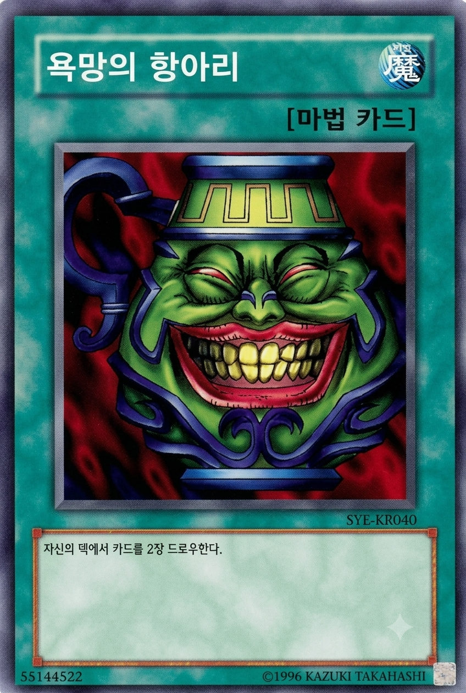
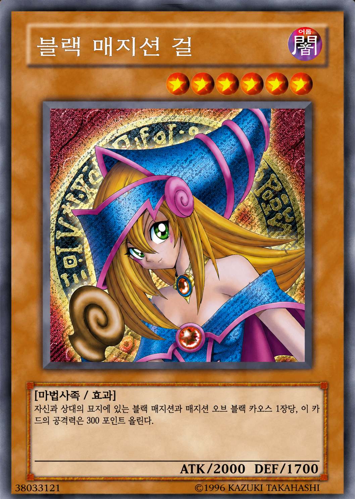

  

 

# 👋🏻 팀 소개 👋🏻

## 📌 팀명

### SKN34-2nd-4Team : 🌟 불사조 🌟

> 데이터 속에서 새로운 가능성을 발견하고, 실패를 성장의 불꽃으로 바꾸며 다시 날아오르는 팀입니다.

 

## 📌 팀 멤버

<table>
  <thead>
    <tr>
      <th align="center">김건우</th>
      <th align="center">이성민</th>
      <th align="center">전진영</th>
      <th align="center">최성욱</th>
      <th align="center">황수빈</th>
    </tr>
  </thead>
  <tbody>
    <tr>
      <td align="center"></td>
      <td align="center"></td>
      <td align="center"></td>
      <td align="center"></td>
      <td align="center"></td>
    </tr>
    <tr>
      <td align="center"><a href="https://github.com/ilil1">@ilil1</a></td>
      <td align="center"><a href="https://github.com/lsm15111">@lsm15111</a></td>
      <td align="center"><a href="https://github.com/msi67811-jpg">@msi67811-jpg</a></td>
      <td align="center"><a href="https://github.com/Overlay1010">@Overlay1010</a></td>
      <td align="center"><a href="https://github.com/subinss838">@subinss838</a></td>
    </tr>
    <tr>
      <td align="center">팀원1</td>
      <td align="center"><strong>팀장</strong></td>
      <td align="center">팀원2</td>
      <td align="center"><strong>팀장</strong></td>
      <td align="center">팀원3</td>
    </tr>
  </tbody>
</table>
