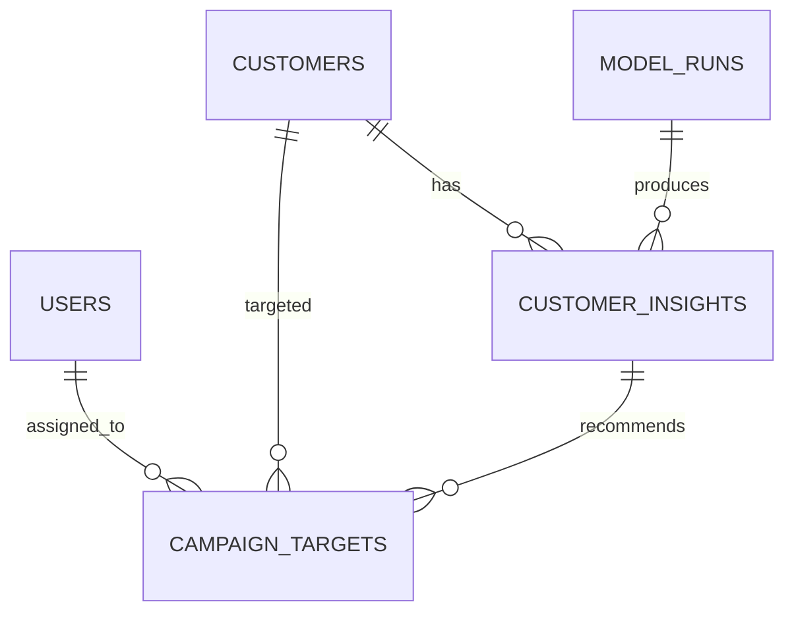

# CardOps 데이터베이스와 Alembic 가이드

구현 배경, 파일별 책임, migration 동작, 고객 CSV 적재와 테스트 결과를 포함한
전체 구현 문서는 [`phase1_database_implementation.md`](phase1_database_implementation.md)입니다.

## 구성 목적

MySQL에는 로그인 계정뿐 아니라 고객 원본 특성, 모델 실행 이력, 고객별 통합 분석
결과와 캠페인 처리 이력을 저장합니다. 테이블 변경은 SQLAlchemy `create_all()`이
아니라 Alembic migration 파일로 관리합니다.



## 테이블

| 테이블 | 저장 내용 |
|---|---|
| `users` | 팀 계정, Argon2 비밀번호 해시, 활성 여부, 업무 역할 |
| `customers` | `CLIENTNUM`을 보존한 고객 ID와 모델 입력 특성 19개 |
| `model_runs` | 모델 종류·버전, artifact 경로·SHA-256, 실행 시각·상태 |
| `customer_insights` | 이탈 확률·위험 등급, 예상 거래건수·활동성 갭, 군집·추천 액션 |
| `campaign_targets` | 대상 고객, 담당자, 캠페인 상태·처리 시각·결과 |

`CLIENTNUM`은 고객 조회와 테이블 연결에만 사용하며 모델 입력에는 포함하지
않습니다. `customer_insights`는 고객별 최신 값만 덮어쓰지 않고 분석 시점별로
누적합니다. 각 행은 분류·회귀·군집 `model_runs`를 각각 참조해 결과의 계보를
추적할 수 있습니다.

## 사용자 역할

역할은 다음 네 가지입니다.

- `admin`: 사용자·설정 관리
- `analyst`: 모델과 분석 결과 관리
- `operations`: 우선관리 고객과 상담 업무
- `marketing`: 캠페인 대상과 결과 관리

회원가입 API에서 역할을 입력받지 않으며 모든 신규 계정은 최소권한인
`operations`로 생성됩니다. 역할 변경과 역할별 API 권한 검사는 후속 기능입니다.

## Migration 적용

호스트에서 Backend를 직접 실행할 때는 API 시작 전에 다음 명령을 실행합니다.

```bash
source project_venv/bin/activate
python -m backend.app.migration_runner
```

이 명령은 다음 두 경우를 모두 처리합니다.

1. 빈 DB: `users`부터 전체 migration을 순서대로 적용
2. 기존 DB: `create_all()`로 만들어진 `users` 테이블과 회원을 보존하고 기준선
   revision을 기록한 뒤 신규 테이블 적용

적용된 revision을 확인할 수 있습니다.

```bash
alembic -c backend/alembic.ini current
alembic -c backend/alembic.ini history
```

Docker Compose에서는 Backend 컨테이너의 entrypoint가 API를 시작하기 전에
`migration_runner`를 자동 실행합니다.

## 고객 데이터 적재

Migration 후 원본 CSV의 고객 10,127명을 적재합니다.

호스트에서 실행:

```bash
python -m backend.scripts.import_customers
```

Docker에서 실행:

```bash
docker compose exec backend python -m backend.scripts.import_customers
```

적재는 `CLIENTNUM` 기준 upsert 방식이라 같은 명령을 다시 실행해도 고객이
중복되지 않고 변경된 특성만 갱신됩니다. 원본의 `Attrition_Flag`와 기존
Naive Bayes 결과 컬럼은 `customers` 테이블에 저장하지 않습니다.

## 새 스키마 변경 만들기

SQLAlchemy 모델을 먼저 변경한 뒤 migration을 자동 생성합니다.

```bash
alembic -c backend/alembic.ini revision --autogenerate -m "변경 설명"
alembic -c backend/alembic.ini check
python -m backend.app.migration_runner
```

자동 생성된 migration은 적용 전에 반드시 검토합니다. 운영 데이터가 있는 DB에서
`downgrade`, 컬럼 삭제 또는 타입 축소를 실행할 때는 별도 백업과 승인이 필요합니다.

## 현재 범위

현재 단계에서는 저장 스키마와 고객 적재까지 제공합니다. `model_runs`,
`customer_insights`, `campaign_targets`를 채우는 모델 배치 작업과 이 테이블을
조회·수정하는 API는 다음 단계에서 구현합니다.
